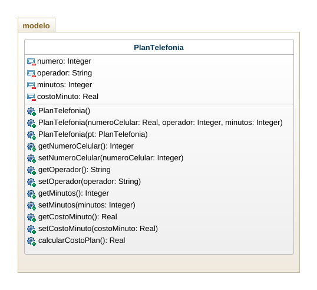

## Ejercicio
- Crear un programa para gestionar un plan de telefonia celular. El plan tiene un numero de celular, un operador, una cantidad de minutos y un costo por minuto. Calcular el total a pagar teniendo en cuenta que si el operador es movilujo tiene un 50% de descuento. Usar minimo tres constructores. 
        -> Analisis
            - Plan 
            - Numero celular
            - Operador
            - Cantidad minutos
            - Costo por minuto
            - Costo plan 
            - Descuento

        -> Diseño
        #Diagramas de clases
    
        -> Construccion